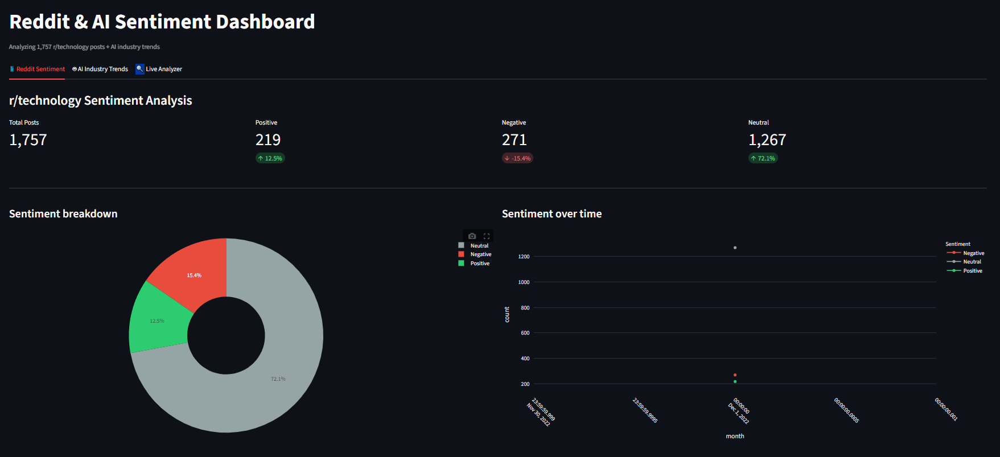
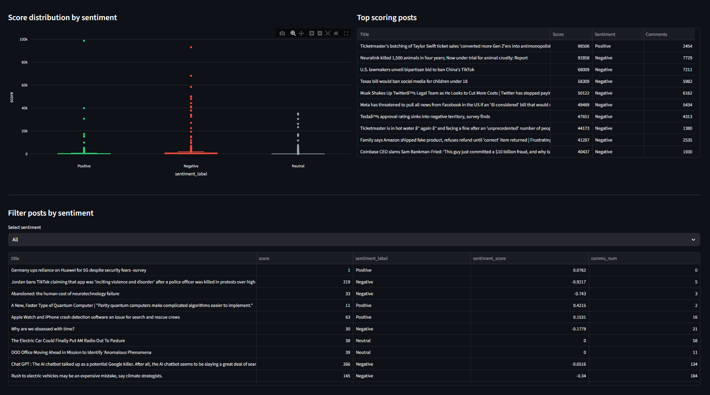
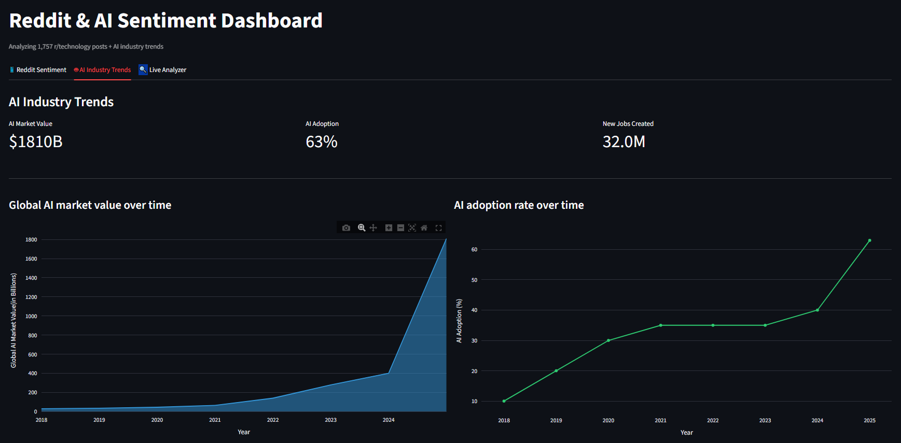
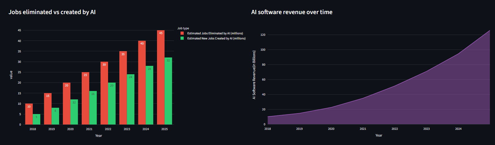
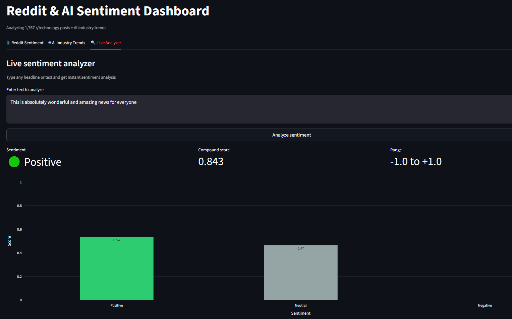

# Reddit & AI Sentiment Dashboard

An interactive multi-tab dashboard analyzing sentiment across 1,757 r/technology posts and AI industry trends — built with Python, VADER NLP, and Streamlit.


---

## Demo







---

## What It Does

- Analyzes **1,757 r/technology Reddit posts** using VADER sentiment analysis
- Classifies each post as **Positive, Negative or Neutral** with a compound score
- Displays **sentiment trends over time** with interactive Plotly charts
- Shows **AI industry trends** — market value, adoption rate, jobs, revenue from 2018–2025
- Includes a **live sentiment analyzer** — type any text and get instant results

---

## Key Findings

| Insight | Finding |
|---------|---------|
| Overall sentiment | 72.1% Neutral, 15.4% Negative, 12.5% Positive |
| r/technology skew | Slightly more negative than positive — consistent with critical tech news |
| Top post score | 99,836 upvotes (Taylor Swift ticket scalping story) |
| Global AI market | Grew from ~$50B (2018) to $1,810B (2025) |
| AI adoption | From 10% (2018) to 63% (2025) |
| Jobs created by AI | 32M new jobs estimated vs jobs eliminated |

---

## Tech Stack

| Layer | Technology |
|-------|-----------|
| UI | Streamlit |
| NLP | VADER Sentiment Analysis |
| Data processing | Pandas |
| Visualization | Plotly Express |
| Database | SQLite |
| Dataset | Kaggle — r/technology posts + AI industry trends |

---

## Project Structure
reddit-sentiment-dashboard/

├── app.py              # Main Streamlit dashboard

├── database.py         # CSV to SQLite loader

├── sentiment.py        # VADER sentiment scoring

├── data/

│   ├── technology.csv

│   ├── The Rise Of Artificial Intellegence2.csv

│   └── reddit.db

├── screenshots/

├── requirements.txt

└── .env

---

## How to Run Locally

**1. Clone the repo**
```bash
git clone https://github.com/aryzus/reddit-sentiment-dashboard.git
cd reddit-sentiment-dashboard
```

**2. Create and activate virtual environment**
```bash
python -m venv venv
venv\Scripts\activate      # Windows
source venv/bin/activate   # Mac/Linux
```

**3. Install dependencies**
```bash
pip install -r requirements.txt
```

**4. Download datasets**

Place these in the `data/` folder:
- [r/technology Reddit posts](https://www.kaggle.com/datasets/thedevastator/uncovering-technology-insights-through-reddit-di)
- [Rise of AI dataset](https://www.kaggle.com/datasets/muhammadroshaanriaz/the-rise-of-artificial-intelligence)

**5. Build the database and run sentiment analysis**
```bash
python database.py
python sentiment.py
```

**6. Run the dashboard**
```bash
python -m streamlit run app.py
```

---

## Dashboard Tabs

### Tab 1 — Reddit Sentiment
- Sentiment breakdown donut chart
- Sentiment trend over time line chart
- Score distribution by sentiment box plot
- Top 10 highest scoring posts table
- Filter posts by sentiment label

### Tab 2 — AI Industry Trends
- Global AI market value growth (2018–2025)
- AI adoption rate over time
- Jobs eliminated vs created by AI
- AI software revenue growth

### Tab 3 — Live Analyzer
- Type any headline or text
- Get instant Positive / Negative / Neutral classification
- Compound score from -1.0 to +1.0
- Visual breakdown bar chart

---

## Skills Demonstrated

- **NLP** — VADER sentiment analysis on real Reddit data
- **Data pipeline** — CSV → SQLite → Pandas → Streamlit
- **Multi-tab dashboard** — 3 tabs, 8 interactive charts
- **Data visualization** — Plotly area, line, bar, box, pie charts
- **Real dataset analysis** — 1,757 posts with actionable insights